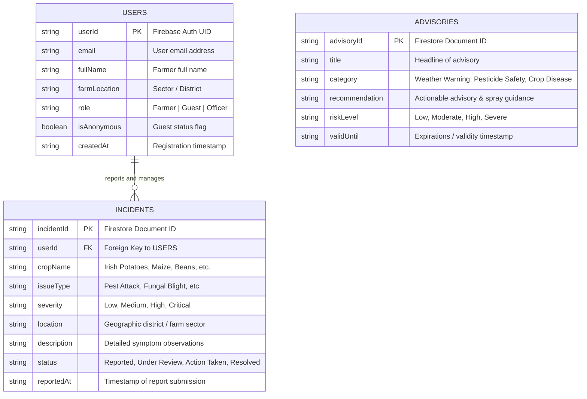

# AgroSafe - Mobile Application Development Final Project

**AgroSafe** is a comprehensive, production-grade Flutter mobile application built with Clean Architecture, BLoC state management, and Firebase integration. The platform empowers farmers and agricultural extension officers to monitor crop health, report pest/disease incidents in real-time, access weather and pesticide safety advisories, and customize accessibility and language preferences (English and Kinyarwanda).

---

## 🌟 Key Features & Capabilities

- **Clean Architecture Layout**: Strict separation into `presentation/`, `domain/`, `data/`, and `core/` layers.
- **Advanced State Management**: BLoC (`flutter_bloc`) handles all business logic; UI components remain clean and stateless.
- **Dual Authentication**:
  1. Secure Email & Password sign-up, sign-in, and session persistence.
  2. Guest Farmer access with instant onboarding.
- **Full Firestore CRUD Operations**:
  - **Create**: Report new crop health incidents with severity ratings, issue categories, and locations.
  - **Read**: Real-time streams and filtered views of incidents and safety advisories.
  - **Update**: Edit incident details, severity, and resolution status.
  - **Delete**: Safely remove outdated or resolved incident records with confirmation dialogs.
- **Persistent Preferences (SharedPreferences)**:
  - **Theme Mode**: System, Light, and Dark themes.
  - **Localization**: English (`en`) and Kinyarwanda (`rw`) multi-lingual support.
  - **High Contrast Mode**: Enhanced visual clarity for low-literacy or outdoor visibility.
- **Tested & Quality Assured**: Unit tests for BLoCs/Cubits and Widget tests for UI components. Clean code formatting (`dart format`) and 0 `flutter analyze` warnings.

---

## 📁 Clean Architecture Directory Structure

```
lib/
├── app.dart                                 # MultiBlocProvider & MaterialApp configuration
├── main.dart                                # Application entry point & service locator setup
├── core/
│   ├── error/                               # Failures & Exceptions definitions
│   ├── services/                            # GetIt dependency injection & SharedPreferences
│   ├── theme/                               # Material 3 Light/Dark/High-Contrast themes
│   ├── usecase/                             # Abstract UseCase interfaces
│   └── utils/                               # App constants & English/Kinyarwanda strings
└── features/
    ├── auth/                                # Authentication feature
    │   ├── data/                            # User models & Auth datasources
    │   ├── domain/                          # User entity, repo interface & use cases
    │   └── presentation/                    # AuthBloc, Login, Register & Splash screens
    ├── incident/                            # Crop Incident CRUD feature
    │   ├── data/                            # Incident model & Firestore datasource
    │   ├── domain/                          # Incident entity, repo interface & use cases
    │   └── presentation/                    # IncidentBloc, List, Detail & Add/Edit screens
    ├── weather_advisory/                    # Advisories feature
    │   ├── data/                            # Advisory model & datasource
    │   ├── domain/                          # Advisory entity, repo interface & use case
    │   └── presentation/                    # AdvisoryCubit & Advisory screen
    └── settings/                            # User Preferences feature
        ├── data/                            # Local settings datasource
        ├── domain/                          # Settings entity & use cases
        └── presentation/                    # SettingsCubit & Settings page
```

---

## 🗄️ Database Architecture (ERD)



---

## 🔒 Firebase Security Rules Summary

The `firestore.rules` file enforces data privacy and authorization restrictions:
- `users/{userId}`: Only authenticated owners (`request.auth.uid == userId`) can read or modify their profile document.
- `incidents/{incidentId}`: Read access open to authenticated users; write/update/delete operations strictly restricted to the user who created the record (`resource.data.userId == request.auth.uid`).
- `advisories/{advisoryId}`: Read-only access for all authenticated users; modifications restricted to admin tokens.

---

## 🚀 Setup & Execution Instructions

### Prerequisites
- Flutter SDK (v3.12.0 or newer)
- Dart SDK (v3.12.0 or newer)
- Android Emulator / Physical Device or iOS Simulator

### 1. Clone Repository & Install Dependencies
```bash
git clone https://github.com/AgroSafeTeam/agrosafe.git
cd agrosafe
flutter pub get
```

### 2. Run Code Formatting & Static Analysis
```bash
dart format .
flutter analyze
```

### 3. Execute Unit & Widget Tests
```bash
flutter test
```

### 4. Launch the App
```bash
flutter run
```

---

## 👥 Group Member Contributions

| Member | Track | Key Responsibilities |
|---|---|---|
| **Placide Igabe** | Frontend Lead | Figma to Flutter UI implementation, Stateless widget design, Navigation wiring |
| **Sonia Bayingana** | Accessibility & UI | English/Kinyarwanda localization (`i18n_strings.dart`), High-contrast mode |
| **Selena Isimbi** | Backend & Data | Weather advisory cubit, ERD design, Firestore repository layer |
| **Placide Niyonizeye**| Backend & Auth | BLoC Clean Architecture setup, Firebase Auth implementation, Security rules |
| **Ketia Gakwaya** | Testing & Docs | Unit/Widget test suite implementation, Final Report & Contribution tracking |
