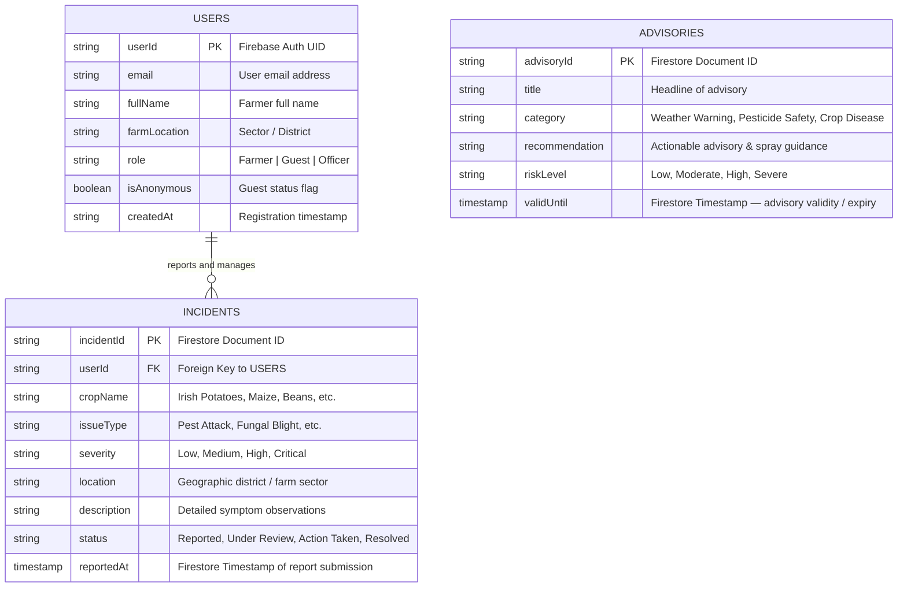

# AgroSafe - Database Architecture & ERD Specification

## 1. Overview
The AgroSafe mobile application relies on a structured, scalable NoSQL Firestore database architecture designed according to Clean Architecture principles. The entity model mirrors real-world agricultural safety management workflows, maintaining strict integrity, minimal data redundancy, and secure data isolation per user.

---

## 2. Entity-Relationship Diagram (ERD)

---

## 3. Detailed Data Collections & Field Specifications

### 3.1 `users` Collection
- **Primary Key**: `userId` (Matches `request.auth.uid` in Firebase Auth)
- **Attributes**:
  - `email` *(String, Indexed)*: Unique email address of the registered farmer.
  - `fullName` *(String)*: User's display name.
  - `farmLocation` *(String)*: Registered farming sector or district (e.g., Musanze, Nyange Sector).
  - `role` *(String)*: Role designation (default: `Farmer`).
  - `isAnonymous` *(Boolean)*: Identifies guest session instances.
  - `createdAt` *(String / ISO8601)*: Timestamp when the account was initialized.

### 3.2 `incidents` Collection
- **Primary Key**: `incidentId` (Auto-generated Firestore document ID)
- **Foreign Key**: `userId` -> References `users.userId`
- **Attributes**:
  - `cropName` *(String, Indexed)*: Crop variety affected.
  - `issueType` *(String)*: Category of threat (Pest Infestation, Fungal Infection, Soil Erosion).
  - `severity` *(String, Indexed)*: Risk classification (`Low`, `Medium`, `High`, `Critical`).
  - `location` *(String)*: Farm location coordinates or district name.
  - `description` *(String)*: Qualitative notes provided by the farmer.
  - `status` *(String)*: Operational lifecycle state (`Reported`, `Under Review`, `Action Taken`, `Resolved`).
  - `reportedAt` *(Timestamp, Indexed)*: Order key for real-time dashboard sorting.

### 3.3 `advisories` Collection
- **Primary Key**: `advisoryId`
- **Attributes**:
  - `title` *(String)*: Advisory headline.
  - `category` *(String, Indexed)*: Classification (`Weather Warning`, `Pesticide Safety`, `Crop Disease`).
  - `recommendation` *(String)*: Precise treatment or preventive action instructions.
  - `riskLevel` *(String)*: Threat level (`Low`, `Moderate`, `High`, `Severe`).
  - `validUntil` *(Timestamp)*: Expiration timeframe for guidance.

---

## 4. Firestore Indexes
- Single-field index on `incidents.userId` ASC
- Composite index on `incidents.userId` ASC + `incidents.reportedAt` DESC
- Composite index on `incidents.severity` ASC + `incidents.reportedAt` DESC
- Composite index on `advisories.category` ASC + `advisories.validUntil` DESC
